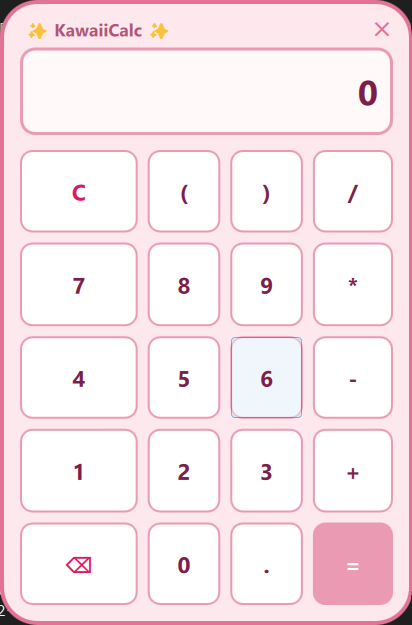

# 🎀 KawaiiCalc (BitBlush)

A retro-styled, pastel pixel-art desktop calculator inspired by 90s magical girl flip-phones. Built natively in **C++** using **Qt 6 & QML** for lightweight, hardware-accelerated performance without JavaScript overhead.

---

## ✨ Preview

<div align="center">
  
</div>

---

## 🌸 Key Features

- **Retro Aesthetic**: Custom flip-phone silhouette featuring soft pastel pink tones, curved borders, and pixel-inspired styling.
- **Frameless & Draggable**: Floating desktop widget with custom window flags and seamless click-and-drag movement.
- **Pure C++ Math Engine**: Infix mathematical expressions parsed and evaluated directly in C++ using a 2-Stack algorithm (no regex / no `eval`).
- **Hardware-Accelerated UI**: Built with Qt Quick / Scene Graph for smooth rendering and lightweight system resource usage.

---

## 🛠️ Tech Stack

- **Framework**: Qt 6 (Qt Quick / QML)
- **Language**: C++17
- **Build System**: CMake (>= 3.16)
- **Compiler**: MinGW / GCC / Clang / MSVC

---

## 📂 Project Structure

```text
KawaiiCalc/
├── CMakeLists.txt        # CMake build configuration & QML module setup
├── main.cpp              # Application entry point & QML engine registration
├── calcengine.h          # C++ Calculator backend header (QObject & Q_INVOKABLE)
├── calcengine.cpp        # 2-Stack Infix evaluation engine implementation
└── Main.qml              # Custom frameless pastel UI and keypad grid